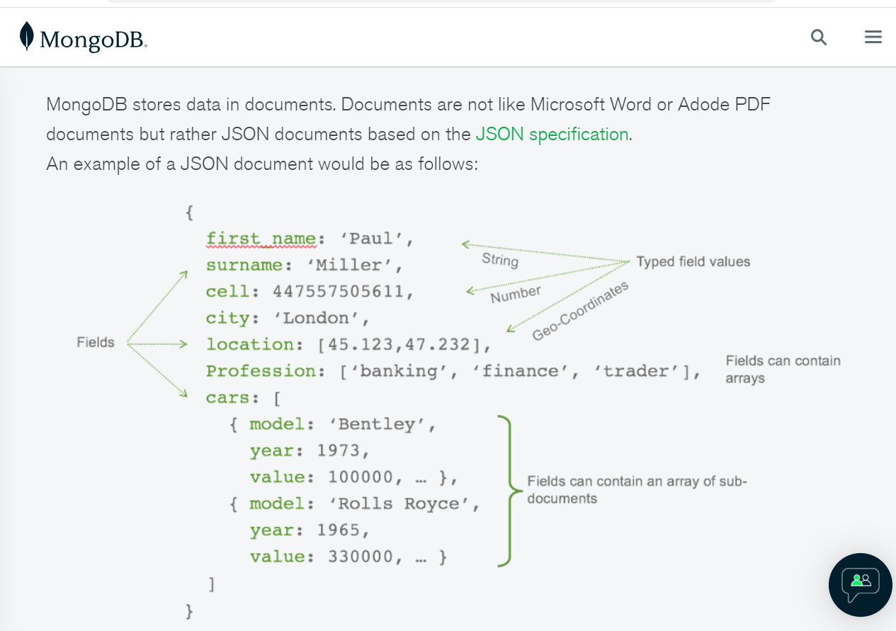

# mongoDBconnect

 Reference:

 

 JSON doc example:
 
 

   

 Source: Getting Started with Python and MongoDB | MongoDB Blog 
 

 

 https://www.mongodb.com/blog/post/getting-started-with-python-and-mongodb

 

 Connect to MongoDB example:
 
 

   

 Source: YAML with Python
 

 

 https://blog.devgenius.io/yaml-with-python-d6787a9bd8ab

